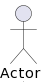
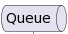
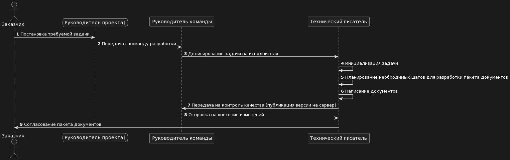

# Описание процесса работы в виде UML-диаграммы последовательности
## Процесс описан в виде диаграммы последовательности с использованием plantuml

### 1. Объявление участников
* Заказчик / Customer
* Руководитель проекта / Project.manager
* Руководитель команды / Team.lead
* Технический писатель / Technical.writer

### 2. Установка индивидуального визуального обозначение для каждого участника
#### При использовании ключевого слова participant возможно получить больший контроль над отображением участников.
#### Порядок перечисления участников задаёт также пороядок отображения участников по умолчанию.
#### Использование других ключевых слов (отличных от participant) позволяет изменить форму представления (отображения) участника:
* Actor - 
* queue - 

### 3. Налаживание последовательных связей между участниками
#### 3.1 Согласование
Этот этап заключается в получении одобрения или согласования соответствующих лиц или стейкхолдеров на планируемые действия. Обычно это включает в себя предоставление необходимой информации заинтересованным сторонам и урегулирование каких-либо разногласий или вопросов.
#### 3.2 Передача в команду разработки
Данный этап предполагает передачу задачи или проекта в команду разработки, где исполнители будут работать над его выполнением.
#### 3.3 Делигирвоание задачи
Это процесс передачи конкретной задачи или ответственности от одного сотрудника или руководителя к другому, обычно с целью выполнения определенных задач или достижения определенных целей.
#### 3.4 Технический писатель инициализирует задачу, которую перед ним поставили, далее, составляет план разработки пакета документов,
На этом этапе технический писатель получает задачу на написание документации, разрабатывает план создания необходимых документов и утверждает его.
#### 3.5 Оформление документов
Здесь технический писатель создает требуемые документы, такие, как заключение экспертизы промышленной безопасности, паспорт, формуляр и т.д. 
#### 3.6 Передача на контроль качества
После завершения документации, она передается на контроль качества для проверки соответствия предъявляемым требованиям и стандартам.
#### 3.7 Внесение изменений
В случае необходимости вносятся коррективы или дополнения в документацию на основе результатов контроля качества.
#### 3.8 Согласование оформленных документов
На последнем этапе оформленная документация проходит процесс согласования с заинтересованными сторонами для утверждения ее окончательной версии.

### 4. Диаграмма в plantuml

Код составленной диаграммы представлен [тут](https://github.com/SuleymanovAnton00/aQsi_Test/blob/main/main)

## PlantUML example

'''plantuml
 
Customer -> Project.manager: Постановка требуемой задачи
Project.manager -> Team.lead: Передача в команду разработки
Team.lead -> Technical.writer: Делигирование задачи на исполнителя
Technical.writer -> Technical.writer: Инициализация задачи
Technical.writer -> Technical.writer: Планирование необходимых шагов для разработки пакета документов
Technical.writer -> Technical.writer: Написание документов
Technical.writer -> Team.lead: Передача на контроль качества (публикация версии на сервер)
Team.lead -> Technical.writer: Отправка на внесение изменений
Technical.writer -> Customer: Согласование пакета документов
'''
